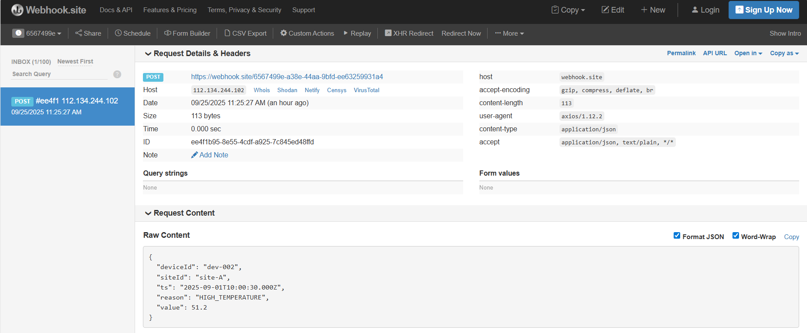

## API Endpoints

- `POST /api/v1/telemetry` - Ingest telemetry data (single or batch)

- `GET /api/v1/devices/{deviceId}/latest` - Get latest reading for a device 

- `GET /api/v1/sites/{siteId}/summary` - Get aggregated site statistics

## Project setup

```````bash
**Clone & Install:**

  git clone https://github.com/<your-org>/<your-repo>.git
  cd <your-repo>
  npm install

**Environment Configuration:**

   Create a `.env` file in the root directory with the following variables:

  MONGO_URI=mongodb+srv://<user>:<pass>@<cluster>/<db>?retryWrites=true&w=majority
  REDIS_URL=redis://localhost:6379
  ALERT_WEBHOOK_URL=https://webhook.site/<your-uuid>
  INGEST_TOKEN=secret123

**Run the Application:**

  npm run start:dev

```````

## Webhook Alert System

The application sends alerts to a configured webhook URL when environmental thresholds are exceeded:



**Alert Payload Structure:**

```json
{
  "deviceId": "sensor-001",
  "siteId": "site-alpha",
  "ts": "2025-09-25T10:30:00Z",
  "reason": "HIGH_TEMPERATURE",
  "value": 55.2
}
```

**Alert Triggers:**

- `HIGH_TEMPERATURE`: When temperature exceeds 50°C
- `HIGH_HUMIDITY`: When humidity exceeds 90%

## AI Assistance in Development

This application was developed with significant AI assistance, which enhanced the development process in several key areas:

• **Error Handling & Validation**: AI contributed to implementing comprehensive input validation using class-validator decorators and robust error handling mechanisms throughout the application pipeline

• **Real-time Alert Logic**: AI helped design and implement the threshold-based alerting system with configurable parameters and reliable webhook delivery mechanisms for critical environmental conditions

• **Aggregation Pipeline Development**: AI assisted in crafting complex MongoDB aggregation pipelines for site-level analytics, enabling efficient computation of statistical summaries across large datasets
